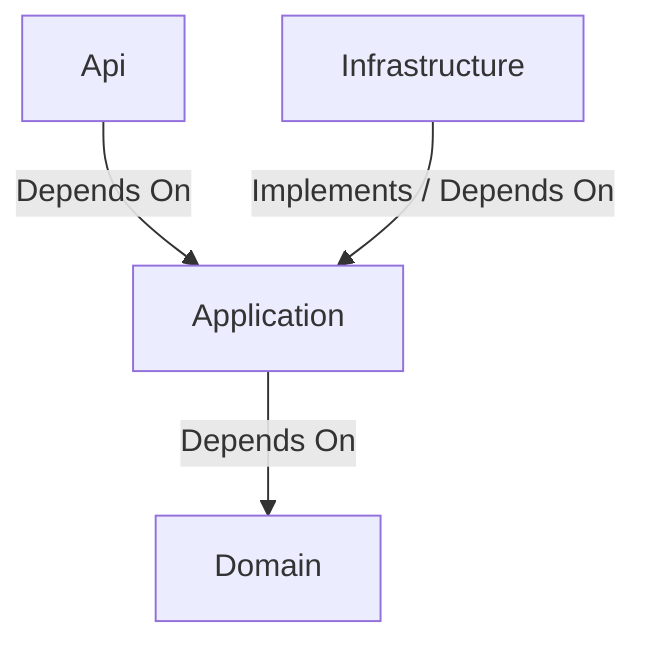

## Context

The application is built following the principles of Clean Architecture (also known as Onion or Hexagonal Architecture). This architectural style emphasizes a separation of concerns, creating a system that is independent of the framework, UI, database, and external agencies. This results in a more testable, maintainable, and scalable application.

## Structure

The architecture is divided into four main layers, arranged as a series of concentric circles, with the most abstract and core business logic at the center.

1.  **Domain Layer**: The innermost layer. It contains the core business entities, enums, and enterprise-wide business rules. It has no dependencies on any other layer. (See `ARCH-domain-entities`)
2.  **Application Layer**: This layer contains the application-specific business logic. It orchestrates the use cases of the application and defines interfaces for external concerns (like repositories). It depends only on the Domain layer. (See `ARCH-application-layer`)
3.  **Infrastructure Layer**: This layer contains the concrete implementations of the interfaces defined in the Application Layer. This includes database access code (EF Core), file system access, third-party API clients, and other external services. It depends on the Application and Domain layers. (See `ARCH-infrastructure-layer`)
4.  **API (Presentation) Layer**: The outermost layer. It is the entry point to the application (in this case, an ASP.NET Core Web API). It is responsible for handling HTTP requests, routing, and presenting data to the client. It depends on the Application and Infrastructure layers for dependency injection and to initiate use cases. (See `ARCH-api-layer`)

## Behavior

### The Dependency Rule

The fundamental rule of this architecture is that source code dependencies can only point inwards.

- The `Domain` layer knows nothing about the outer layers.
- The `Application` layer knows about `Domain` but not about `Infrastructure` or `API`.
- The `Infrastructure` and `API` layers know about `Application` and `Domain`.

This rule ensures that changes in outer layers (like swapping a database or changing the web framework) have minimal to no impact on the core business logic in the Application and Domain layers.

