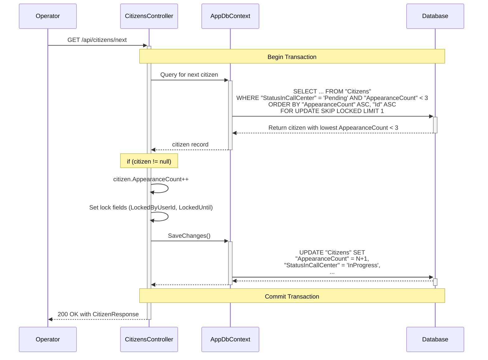

# Refactoring/Design Plan: Introduce Appearance-Based Sorting and Filtering for `GetNextCitizen`

## 1. Executive Summary & Goals

This plan details the necessary changes to implement an "appearance count" logic for the `GET /api/citizens/next` endpoint. The primary objective is to improve the fairness and efficiency of record distribution to operators by prioritizing less-seen records and automatically filtering out records that are repeatedly skipped.

The key goals are:

1.  **Introduce `AppearanceCount`:** Add a new integer property to the `CitizenRecord` to track how many times it has been presented to an operator.
2.  **Modify `GetNextCitizen` Logic:** Update the endpoint to prioritize records with the lowest `AppearanceCount`, ensuring a more even rotation of all available records.
3.  **Implement Filtering Threshold:** Automatically filter out records from the `GetNextCitizen` queue once their `AppearanceCount` reaches a threshold of 3.
4.  **Ensure Data Integrity:** The new property must be correctly handled during database migrations, data import, and data export operations.

## 2. Current Situation Analysis

Based on the provided file structure and code, the current system (`Hamal.Web/Controllers/CitizensController.cs`) implements the `GetNextCitizen` endpoint using a raw SQL query. This query fetches the first available record with `StatusInCallCenter = 'Pending'` sorted by its primary key (`Id`).

**Key Pain Point:**

- The `ORDER BY "Id"` logic is deterministic but inflexible. If the first few available records are not relevant for some reason (and are not updated, causing their locks to expire), they will be repeatedly served to the next available operator. This reduces operator efficiency and delays the processing of other records. The new requirement to filter out these records after 3 attempts will solve this issue directly.

## 3. Proposed Solution / Refactoring Strategy

### 3.1. High-Level Design / Architectural Overview

The solution involves introducing a new field, `AppearanceCount`, to the `CitizenRecord` domain entity. This field will serve as the primary sorting key for the `GetNextCitizen` query. The query's `WHERE` clause will be modified to only select records where `AppearanceCount < 3`. Each time a record is successfully selected and locked by this endpoint, its `AppearanceCount` will be incremented. This ensures that records are fairly rotated and are automatically removed from the active queue after three unsuccessful presentation attempts.

The changes will be localized to the Domain, Infrastructure, and Web API layers, respecting the existing Clean Architecture.



### 3.2. Key Components / Modules

- **`Hamal.Domain.Entities.CitizenRecord`:** To be modified to include the new `AppearanceCount` property.
- **`Hamal.Web.Controllers.CitizensController`:** The `GetNextCitizen` method will be updated to change the query's `WHERE` and `ORDER BY` clauses and to increment the new counter.
- **`Hamal.Infrastructure.Persistence`:** An EF Core migration is required to add the corresponding column to the database, including a performance-critical filtered index.
- **`Hamal.Infrastructure.Files.CsvExporter`:** The exporter will be updated to include `AppearanceCount` in the output file.
- **`Hamal.Infrastructure.Files.CsvParser`:** The parser will be updated to handle the new field on import by setting a default value.

### 3.3. Detailed Action Plan / Phases

#### Phase 1: Domain and Database Layer Modifications

- **Objective(s):** Establish the data model and database schema foundation for the new feature.
- **Priority:** High
- **Task 1.1: Update the Domain Entity**

  - **Rationale/Goal:** Add the new property to the core business entity.
  - **File to Modify:** `src/Hamal.Domain/Entities/CitizenRecord.cs`
  - **Action:** Add the following property:
    ```csharp
    public int AppearanceCount { get; set; }
    ```
  - **Estimated Effort:** S
  - **Deliverable/Criteria for Completion:** The `CitizenRecord` class contains the new `AppearanceCount` property.

- **Task 1.2: Generate EF Core Migration**

  - **Rationale/Goal:** Create a migration to add the `AppearanceCount` column to the `Citizens` table in the database.
  - **Action:** Run the `dotnet ef migrations add AddAppearanceCountToCitizenRecord` command.
  - **Verification:** The generated migration file should include:
    - `migrationBuilder.AddColumn<int>("AppearanceCount", "Citizens", nullable: false, defaultValue: 0);`
  - **Estimated Effort:** S
  - **Deliverable/Criteria for Completion:** A new EF Core migration file exists and correctly defines the new column with a non-nullable constraint and a default value of 0.

- **Task 1.3: Add Performance Index in Migration**

  - **Rationale/Goal:** Create a highly-efficient filtered database index to ensure the `GetNextCitizen` query remains performant with the new `WHERE` and `ORDER BY` criteria.
  - **Action:** Manually edit the migration file from Task 1.2 to add the filtered index.
    ```csharp
    migrationBuilder.CreateIndex(
        name: "IX_Citizens_Pending_By_Appearance", // A more descriptive name
        table: "Citizens",
        columns: new[] { "AppearanceCount", "Id" }) // The columns to sort by
        .Annotation("Npgsql:IndexWhere", "\"StatusInCallCenter\" = 'Pending' AND \"AppearanceCount\" < 3"); // The PostgreSQL syntax for a filtered index
    ```
  - **Estimated Effort:** S
  - **Deliverable/Criteria for Completion:** The migration file includes the `CreateIndex` command for the new filtered index.

- **Task 1.4: Apply the Migration**
  - **Rationale/Goal:** Update the database schema.
  - **Action:** Run `dotnet ef database update`.
  - **Estimated Effort:** S
  - **Deliverable/Criteria for Completion:** The `Citizens` table in the database has the new `AppearanceCount` column and the associated filtered index.

#### Phase 2: Core Logic Implementation

- **Objective(s):** Update the `GetNextCitizen` endpoint to use the new sorting, filtering, and incrementing logic.
- **Priority:** High
- **Task 2.1: Update `GetNextCitizen` Query and Logic**

  - **Rationale/Goal:** Implement the primary feature requirements: filter by `AppearanceCount < 3`, sort by `AppearanceCount`, and increment the value on retrieval.
  - **File to Modify:** `src/Hamal.Web/Controllers/CitizensController.cs`
  - **Action:**

    1.  Modify the raw SQL query's `WHERE` and `ORDER BY` clauses.
        **From:**
        ```sql
        SELECT * FROM "Citizens"
        WHERE "StatusInCallCenter" = {0}
        ORDER BY "Id"
        FOR UPDATE SKIP LOCKED
        LIMIT 1
        ```
        **To:**
        ```sql
        SELECT * FROM "Citizens"
        WHERE "StatusInCallCenter" = {0} AND "AppearanceCount" < 3
        ORDER BY "AppearanceCount" ASC, "Id" ASC
        FOR UPDATE SKIP LOCKED
        LIMIT 1
        ```
    2.  Add the increment logic after a citizen is successfully fetched and before `SaveChangesAsync`.

        ```csharp
        // ... after citizen is found
        if (citizen is null)
        {
            // ...
        }

        citizen.AppearanceCount++; // <-- Add this line
        citizen.StatusInCallCenter = CitizenStatus.InProgress;
        // ... rest of the logic
        ```

  - **Estimated Effort:** M
  - **Deliverable/Criteria for Completion:** The `GetNextCitizen` method correctly filters, sorts, and increments `AppearanceCount` within the existing database transaction.

#### Phase 3: Data Import/Export Integration

- **Objective(s):** Ensure the new field is correctly handled in bulk data operations.
- **Priority:** Medium
- **Task 3.1: Update CSV Exporter**

  - **Rationale/Goal:** Include the `AppearanceCount` in data exports for completeness and administrative review.
  - **File to Modify:** `src/Hamal.Infrastructure/Files/CsvExporter.cs`
  - **Action:**
    1.  Add `"AppearanceCount"` to the header string.
    2.  Append the `citizen.AppearanceCount` value in the loop when building each row.
  - **Estimated Effort:** S
  - **Deliverable/Criteria for Completion:** Exported CSV files contain an `AppearanceCount` column with the correct values.

- **Task 3.2: Update CSV Parser**
  - **Rationale/Goal:** Ensure newly imported records start with a default `AppearanceCount` of 0.
  - **File to Modify:** `src/Hamal.Infrastructure/Files/CsvParser.cs`
  - **Action:** Explicitly set the value to 0 for clarity.
    ```csharp
    var citizen = new CitizenRecord
    {
        // ... existing properties
        AppearanceCount = 0, // Explicitly set to 0
        StatusInCallCenter = CitizenStatus.Pending,
        // ...
    };
    ```
  - **Estimated Effort:** S
  - **Deliverable/Criteria for Completion:** Records created via CSV import are persisted with `AppearanceCount = 0`.

### 3.4. Data Model Changes

- **Entity:** `Hamal.Domain.Entities.CitizenRecord`
  - **Added Property:** `public int AppearanceCount { get; set; }`
- **Database Table:** `Citizens`
  - **Added Column:** `AppearanceCount` (`integer`, `not null`, `default 0`)
  - **Added Index:** A filtered index on `(AppearanceCount, Id)` where `StatusInCallCenter = 'Pending'` and `AppearanceCount < 3` to optimize the `GetNextCitizen` query.

### 3.5. API Design / Interface Changes

- **No external API changes.** The `AppearanceCount` is an internal implementation detail. It will not be added to the `CitizenResponse` contract.

## 4. Key Considerations & Risk Mitigation

### 4.1. Technical Risks & Challenges

- **Performance Degradation:** The new `WHERE` and `ORDER BY` clauses could slow down the `GetNextCitizen` query on large datasets.
  - **Mitigation:** This is directly addressed by **Task 1.3**, which mandates the creation of a highly efficient filtered database index.
- **Permanent Record Exhaustion:** Records that reach an `AppearanceCount` of 3 will no longer be available to any operator via the `GetNextCitizen` endpoint. This is the intended behavior, but it effectively removes them from the primary workflow.
  - **Mitigation:** This behavior should be clearly communicated to the system administrators. The `CsvExporter` update (Task 3.1) allows them to export all data, including these "exhausted" records, for offline analysis or manual intervention if needed.
- **Hardcoded Threshold:** The filtering threshold is hardcoded to `3`.
  - **Mitigation:** The value is simple to change in the one location (`CitizensController`). For now, this is acceptable. If this value needs to be frequently adjusted, a future task could move it to application settings.

### 4.2. Dependencies

- The tasks are sequential. Phase 1 (Database) must be completed before Phase 2 (Logic) can be fully tested.
- No external team dependencies are identified.

### 4.3. Non-Functional Requirements (NFRs) Addressed

- **Performance:** The plan's use of a specific filtered index is a direct and robust strategy to ensure the `GetNextCitizen` endpoint remains highly performant.
- **Reliability:** The changes are contained within the existing atomic transaction, ensuring data consistency. The new filtering logic improves system reliability by preventing operators from being stuck with un-actionable records.
- **Usability:** The change directly improves operator workflow efficiency by ensuring a better rotation and eventual removal of problematic records from their queue.

## 5. Success Metrics / Validation Criteria

- **Quantitative:**
  - The performance of the `GET /api/citizens/next` endpoint remains within acceptable latency thresholds (e.g., < 200ms).
  - Executing `SELECT * FROM "Citizens" WHERE "AppearanceCount" >= 3 AND "StatusInCallCenter" = 'Pending'` should show records that are now being correctly excluded from the queue.
- **Qualitative:**
  - **Primary Validation:** A call to `GET /api/citizens/next` **never** returns a citizen record where `AppearanceCount` is 3 or more.
  - Operator feedback confirms a better variety in the records they receive and that "stuck" records eventually disappear from the queue.

## 6. Assumptions Made

1.  **Sorting Goal:** The user's request mentioned "sort desc" but the goal described ("send the record with minimal appearanceCount") implies sorting in **ascending** order. This plan implements ascending order to meet the stated goal.
2.  **Filtering Threshold:** The appearance limit for filtering is fixed at `3`. This value will be hardcoded in the query.
3.  **Exhausted Records:** Records reaching an `AppearanceCount` of 3 are considered "exhausted" and should be permanently removed from the standard operator queue. No further automated processing or alerting is required for them within the scope of this task.
4.  **Client Visibility:** The `AppearanceCount` is a server-side mechanism and does not need to be exposed to the client.

## 7. Open Questions / Areas for Further Investigation

- What is the business process for handling records that have been filtered out (i.e., `AppearanceCount` >= 3)? Is there a need for a separate process or report for administrators to review these "exhausted" records, or are they considered permanently un-callable?
