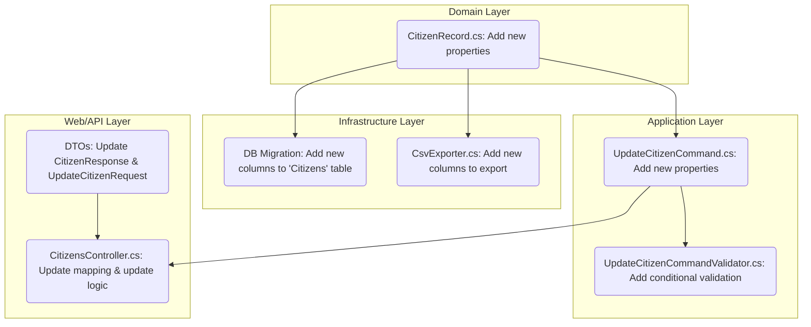

# Refactoring Plan: Enhance CitizenRecord with New Fields (Revised)

## 1. Executive Summary & Goals

This plan details the addition of five new fields to the `CitizenRecord` entity: `IsDead`, `HasTemporaryAddress`, `TemporaryStreetName`, `TemporaryBuildingNumber`, and `TemporaryFlat`. These changes will propagate through all layers of the application, affecting the database, API contracts, and business logic for updating citizen records.

- **Primary Objective:** To enrich the citizen data model to capture mortality status and temporary address information.
- **Key Goals:**
  1.  Modify the database schema and domain entity to include the new fields.
  2.  Expose the new fields in the `GetNextCitizen` API response.
  3.  Enable updating of the new fields via the `UpdateCitizen` API endpoint.
  4.  Ensure new fields are not part of the initial data import but are included in data exports.

## 2. Current Situation Analysis

The existing `Hamal.Domain.Entities.CitizenRecord` entity contains core information about a citizen. The `CitizensController` provides a workflow for operators to fetch a record (`GetNextCitizen`) and submit updates (`UpdateCitizen`). The current model lacks fields to explicitly track if a citizen is deceased or has a separate temporary address, which is the primary limitation this plan addresses. The data import process (`CsvParser`) is designed to populate only the base fields, and this behavior must be preserved. The project already contains established regex patterns for validating address and personal information.

## 3. Proposed Solution / Refactoring Strategy

### 3.1. High-Level Design / Architectural Overview

The changes will follow the existing Clean Architecture pattern, originating in the `Domain` layer and cascading outwards to the `Infrastructure`, `Application`, and `Web` layers.

**Change Propagation Flow:**



### 3.2. Key Components / Modules

- **`Hamal.Domain`:** The `CitizenRecord` entity will be the source of the data model change.
- **`Hamal.Infrastructure`:** `AppDbContext` will require a new EF Core migration. `CsvExporter` will be modified to include the new fields in exports.
- **`Hamal.Application`:** The `UpdateCitizenCommand` and its validator will be updated to handle the new data and associated business rules, reusing existing validation logic.
- **`Hamal.Web`:** The `CitizenResponse` and `UpdateCitizenRequest` DTOs will be modified. The `CitizensController` will be updated to map and process the new fields.

### 3.3. Detailed Action Plan / Phases

#### Phase 1: Domain and Data Persistence Layer

- **Objective(s):** Update the core data model and database schema.
- **Priority:** High

- **Task 1.1: Modify `CitizenRecord` Entity**

  - **Rationale/Goal:** To add the new fields to the core domain entity.
  - **Estimated Effort:** S
  - **Deliverable/Criteria for Completion:** The `src/Hamal.Domain/Entities/CitizenRecord.cs` file is updated with the following properties:
    ```csharp
    public bool IsDead { get; set; }
    public bool HasTemporaryAddress { get; set; }
    public string? TemporaryStreetName { get; set; }
    public string? TemporaryBuildingNumber { get; set; }
    public string? TemporaryFlat { get; set; }
    ```

- **Task 1.2: Generate and Apply Database Migration**
  - **Rationale/Goal:** To persist the new entity fields in the PostgreSQL database.
  - **Estimated Effort:** S
  - **Deliverable/Criteria for Completion:** A new EF Core migration is generated, adding the corresponding columns (`IsDead`, `HasTemporaryAddress`, `TemporaryStreetName`, etc.) to the `Citizens` table. The migration is successfully applied to the development database.

#### Phase 2: Application and API Contract Layer

- **Objective(s):** Expose the new fields through the API and handle their update logic.
- **Priority:** High (Depends on Phase 1)

- **Task 2.1: Update API Data Contracts (DTOs)**

  - **Rationale/Goal:** To allow the frontend to receive and send the new data fields.
  - **Estimated Effort:** S
  - **Deliverable/Criteria for Completion:**
    - `src/Hamal.Web/Contracts/Citizens/CitizenResponse.cs` is updated to include the five new fields.
    - `src/Hamal.Web/Contracts/Citizens/UpdateCitizenRequest.cs` is updated to include the five new fields.

- **Task 2.2: Update `UpdateCitizenCommand`**

  - **Rationale/Goal:** To carry the new data from the controller to the application layer handler (validator).
  - **Estimated Effort:** S
  - **Deliverable/Criteria for Completion:** `src/Hamal.Application/Citizens/Commands/UpdateCitizenCommand.cs` is updated to include the five new fields.

- **Task 2.3: Enhance `UpdateCitizenCommandValidator`**

  - **Rationale/Goal:** To enforce data integrity for the new temporary address fields, reusing existing validation patterns for consistency.
  - **Estimated Effort:** M
  - **Deliverable/Criteria for Completion:** `src/Hamal.Application/Citizens/Commands/UpdateCitizenCommandValidator.cs` is updated. Add a conditional validation rule that applies the project's standard regex patterns:
    ```csharp
    When(x => x.HasTemporaryAddress, () => {
        RuleFor(x => x.TemporaryStreetName).NotEmpty().Matches(HebrewLettersDigitsAndDash)
            .WithMessage("Temporary street name must be at least 3 characters and contain only Hebrew letters, digits, or dashes.");
        RuleFor(x => x.TemporaryBuildingNumber).NotEmpty().Matches(DigitsAndOneHebrewLetter)
             .WithMessage("Temporary building number must contain only digits and at most one Hebrew letter.");
        RuleFor(x => x.TemporaryFlat).NotEmpty().Matches(DigitsOnly)
             .WithMessage("Temporary flat number must contain only digits.");
    });
    ```

- **Task 2.4: Update `CitizensController` Logic**
  - **Rationale/Goal:** To correctly process and map the new fields in API endpoints.
  - **Estimated Effort:** M
  - **Deliverable/Criteria for Completion:** `src/Hamal.Web/Controllers/CitizensController.cs` is modified in two places:
    1.  In `UpdateCitizen`, the mapping from `UpdateCitizenRequest` to `UpdateCitizenCommand` is updated. The logic to update the `CitizenRecord` entity from the command is expanded to include all new fields, paying attention to the conditional nature of the temporary address.
    2.  The `MapToResponse` helper method is updated to map the new fields from the `CitizenRecord` entity to the `CitizenResponse` DTO.

#### Phase 3: Infrastructure Services Update

- **Objective(s):** Ensure data exports are complete.
- **Priority:** Medium

- **Task 3.1: Update `CsvExporter`**
  - **Rationale/Goal:** To include the new fields in the CSV data export for completeness.
  - **Estimated Effort:** S
  - **Deliverable/Criteria for Completion:** `src/Hamal.Infrastructure/Files/CsvExporter.cs` is updated to add the new fields to both the CSV header and each data row.

### 3.4. Data Model Changes

The `Citizens` table in the database will be altered to include the following new columns:

- `IsDead` (boolean, not null, default false)
- `HasTemporaryAddress` (boolean, not null, default false)
- `TemporaryStreetName` (varchar, nullable)
- `TemporaryBuildingNumber` (varchar, nullable)
- `TemporaryFlat` (varchar, nullable)

### 3.5. API Design / Interface Changes

- **`GET /api/citizens/next` (Response: `CitizenResponse`)**:
  - The JSON response body will now include: `isDead`, `hasTemporaryAddress`, `temporaryStreetName`, `temporaryBuildingNumber`, `temporaryFlat`.
- **`PUT /api/citizens/{id}` (Request: `UpdateCitizenRequest`)**:
  - The JSON request body can now include the same five new fields.

## 4. Key Considerations & Risk Mitigation

### 4.1. Technical Risks & Challenges

- **Risk:** Incomplete mapping in the `CitizensController`, leading to data loss on update or missing fields in the response.
  - **Mitigation:** The action plan explicitly calls out updating both the command mapping and the response mapping. A peer review of the `CitizensController` changes is highly recommended.
- **Risk:** Database migration failure on existing data.
  - **Mitigation:** The migration is additive (new columns with defaults), which is a low-risk operation. The migration script should be reviewed and tested on a staging environment before production deployment.

### 4.2. Dependencies

- The frontend team will need to be notified of the API contract changes to `CitizenResponse` and `UpdateCitizenRequest` to implement the corresponding UI components.

### 4.3. Non-Functional Requirements (NFRs) Addressed

- **Maintainability:** By adding explicit fields instead of using a generic "notes" field, the data model becomes more structured and easier to maintain and query.
- **Data Integrity:** The new conditional validation rules in `UpdateCitizenCommandValidator` ensure that if a user indicates a temporary address exists, the address details are provided with the correct format, preventing inconsistent data states.

## 5. Success Metrics / Validation Criteria

1.  After migration, the `Citizens` table in the database contains the five new columns.
2.  A `GET` request to `/api/citizens/next` returns a `CitizenResponse` containing the new fields (with default values for existing records).
3.  A `PUT` request to `/api/citizens/{id}` with the new fields correctly updates the corresponding record in the database.
4.  A `PUT` request with `hasTemporaryAddress: true` but an invalid `temporaryStreetName` (e.g., "AB") is rejected with a `400 Bad Request` and a descriptive error message.
5.  A `GET` request to `/api/admin/citizens` (or the equivalent export endpoint) returns a CSV file that includes columns for the new fields.

## 6. Assumptions Made

- It is assumed that when `HasTemporaryAddress` is `true`, the `TemporaryStreetName`, `TemporaryBuildingNumber`, and `TemporaryFlat` fields become mandatory and must adhere to the project's existing validation patterns.
- It is assumed that all new fields should be included in the admin data export (`CsvExporter`) for data completeness, even though they are not imported.
- The new string fields for the temporary address can be nullable in the database.

## 7. Open Questions / Areas for Further Investigation

- No open questions remain at this time. The validation requirements have been clarified and incorporated into the plan.
