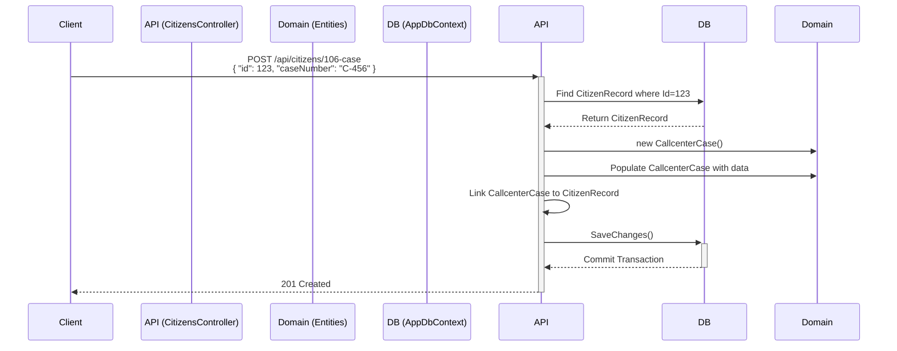

# Refactoring/Design Plan: Add CallcenterCase Entity and Workflow

## 1. Executive Summary & Goals

This plan details the steps required to introduce a new `CallcenterCase` entity into the system. This involves creating the corresponding database table, adding a new API endpoint to create case records associated with a citizen, and updating the existing CSV export functionality to include the new case data.

The key goals are:

- **Extend the Domain:** Introduce the `CallcenterCase` entity to capture new, specific data with timestamps for auditing.
- **Enhance API Functionality:** Provide a mechanism for an external system or client to post and associate a case number with a specific citizen record. This is a create-only operation.
- **Improve Data Export:** Ensure the new case data is included in the administrative CSV export for complete data visibility.

## 2. Current Situation Analysis

The system is built on a standard Clean Architecture pattern, separating Domain, Application, Infrastructure, and Presentation (Web API) layers.

- The `Hamal.Domain` project contains the core entities like `CitizenRecord`.
- The `Hamal.Infrastructure` project handles persistence via EF Core in `AppDbContext` and file operations in `CsvExporter`.
- The `Hamal.Web` project contains the `CitizensController`, which currently interacts directly with the `AppDbContext` to perform its operations.
- The `AdminController` is responsible for bulk data operations, including a `ExportCitizens` endpoint that uses the `CsvExporter` service.

The current system lacks a mechanism to store or associate a specific call center case number with a citizen record. The CSV export is comprehensive for the `CitizenRecord` entity but does not include this new data point.

## 3. Proposed Solution / Refactoring Strategy

### 3.1. High-Level Design / Architectural Overview

The solution involves extending the existing architecture without altering its core principles. We will introduce a new `CallcenterCase` entity in the `Domain` layer and establish a one-to-one relationship with the `CitizenRecord` entity. A new API endpoint will be added to the `CitizensController` to handle the creation of these new case records. Finally, the data retrieval for the CSV export will be updated to include this new related entity.

The flow for the new feature will be:

1.  A `POST` request is sent to `/api/citizens/106-case`.
2.  The `CitizensController` handles the request.
3.  It finds the specified `CitizenRecord`.
4.  It creates a new `CallcenterCase` record and links it to the `CitizenRecord`.
5.  The changes are persisted to the database via `AppDbContext`.



### 3.2. Key Components / Modules

- **`CallcenterCase` (New Entity):** Located in `Hamal.Domain`. Represents a single case.
- **`CitizenRecord` (Modified Entity):** Located in `Hamal.Domain`. Will be updated to include a navigation property to `CallcenterCase`.
- **`AppDbContext` (Modified):** Located in `Hamal.Infrastructure`. Will be updated with a `DbSet<CallcenterCase>` and the entity relationship configuration.
- **`CitizensController` (Modified):** Located in `Hamal.Web`. A new endpoint will be added to handle the creation of `CallcenterCase` records.
- **`CreateCallcenterCaseRequest` (New DTO):** Located in `Hamal.Web`. Defines the contract for the new API endpoint.
- **`CsvExporter` (Modified):** Located in `Hamal.Infrastructure`. Will be updated to include the `callcenter_case_number` in the output file.
- **`AdminController` (Modified):** Located in `Hamal.Web`. The data query for the export function will be modified to eagerly load the related `CallcenterCase` data.

### 3.3. Detailed Action Plan / Phases

#### Phase 1: Domain & Data Model Setup

- **Objective(s):** Establish the core domain entity and prepare the database schema.
- **Priority:** High

- **Task 1.1: Create `CallcenterCase` Entity**
  - **Rationale/Goal:** Define the structure of the new `CallcenterCase` data, including audit timestamps.
  - **Estimated Effort (Optional):** S
  - **Deliverable/Criteria for Completion:**
    - Create a new file `src/Hamal.Domain/Entities/CallcenterCase.cs`.
    - The class should contain properties: `Id` (int, PK), `CallcenterCaseNumber` (string), `CitizenRecordId` (int, FK), `CreatedAt` (DateTime), `UpdatedAt` (DateTime?).
- **Task 1.2: Update `CitizenRecord` Entity**
  - **Rationale/Goal:** Establish the one-to-one relationship from the `CitizenRecord` side.
  - **Estimated Effort (Optional):** S
  - **Deliverable/Criteria for Completion:**
    - Modify `src/Hamal.Domain/Entities/CitizenRecord.cs`.
    - Add a nullable navigation property: `public CallcenterCase? CallcenterCase { get; set; }`.
- **Task 1.3: Update `AppDbContext`**
  - **Rationale/Goal:** Inform Entity Framework Core about the new entity and its relationship.
  - **Estimated Effort (Optional):** S
  - **Deliverable/Criteria for Completion:**
    - Modify `src/Hamal.Infrastructure/Persistence/AppDbContext.cs`.
    - Add `public DbSet<CallcenterCase> CallcenterCases { get; set; }`.
    - In `OnModelCreating`, configure the one-to-one relationship between `CitizenRecord` and `CallcenterCase`. Ensure `CitizenRecordId` in `CallcenterCase` has a foreign key constraint and a unique index to enforce the 1-to-1 relationship.
- **Task 1.4: Create and Apply Database Migration**
  - **Rationale/Goal:** Apply the data model changes to the physical database schema.
  - **Estimated Effort (Optional):** S
  - **Deliverable/Criteria for Completion:**
    - Run the EF Core CLI command to add a new migration (e.g., `dotnet ef migrations add AddCallcenterCaseEntity ...`).
    - Verify the generated migration script correctly creates the `CallcenterCases` table with appropriate columns, keys, and constraints.
    - Apply the migration to the development database (e.g., `dotnet ef database update ...`).

---

#### Phase 2: API Endpoint Implementation

- **Objective(s):** Create the public-facing endpoint to allow for `CallcenterCase` creation.
- **Priority:** High (Depends on Phase 1)

- **Task 2.1: Create Request Contract (DTO)**
  - **Rationale/Goal:** Define a structured data transfer object for the new endpoint's request body.
  - **Estimated Effort (Optional):** S
  - **Deliverable/Criteria for Completion:**
    - Create a new file `src/Hamal.Web/Contracts/Citizens/CreateCallcenterCaseRequest.cs`.
    - Define a `record` with properties: `public int Id { get; init; }` and `public string CaseNumber { get; init; }`.
- **Task 2.2: Add Endpoint to `CitizensController`**
  - **Rationale/Goal:** Implement the business logic for creating and saving the new entity.
  - **Estimated Effort (Optional):** M
  - **Deliverable/Criteria for Completion:**
    - Modify `src/Hamal.Web/Controllers/CitizensController.cs`.
    - Add a new public `async Task<IActionResult>` method with the attribute `[HttpPost("106-case")]`.
    - The method should accept the `CreateCallcenterCaseRequest` from the body.
    - Implementation logic:
      1.  Find the `CitizenRecord` using the `Id` from the request. Return `NotFound` if it doesn't exist.
      2.  Check if a `CallcenterCase` already exists for this citizen to prevent duplicates. Return `Conflict` if one exists.
      3.  Create a new `CallcenterCase` object, populating `CallcenterCaseNumber` from the request, `CitizenRecordId` from the found citizen, and setting `CreatedAt = DateTime.UtcNow`.
      4.  Add the new object to the `dbContext.CallcenterCases`.
      5.  Call `await dbContext.SaveChangesAsync()`.
      6.  Return a `201 Created` or `200 OK` response on success.

---

#### Phase 3: Update CSV Exporter

- **Objective(s):** Integrate the new data point into the existing admin export feature.
- **Priority:** Medium (Depends on Phase 1)

- **Task 3.1: Modify Data Retrieval in `AdminController`**
  - **Rationale/Goal:** Ensure the related `CallcenterCase` data is fetched efficiently along with the `CitizenRecord` data for the export.
  - **Estimated Effort (Optional):** S
  - **Deliverable/Criteria for Completion:**
    - Modify `src/Hamal.Web/Controllers/AdminController.cs`.
    - In the `ExportCitizens` method, change the query from `dbContext.Citizens.AsNoTracking().ToListAsync()` to `dbContext.Citizens.Include(c => c.CallcenterCase).AsNoTracking().ToListAsync()`. This eagerly loads the related data and prevents N+1 query issues.
- **Task 3.2: Update `CsvExporter` Implementation**
  - **Rationale/Goal:** Add the new column to the CSV header and populate it with the case number.
  - **Estimated Effort (Optional):** S
  - **Deliverable/Criteria for Completion:**
    - Modify `src/Hamal.Infrastructure/Files/CsvExporter.cs`.
    - In `ExportToCsv`, add `callcenter_case_number` to the header string.
    - In the loop, append `citizen.CallcenterCase?.CallcenterCaseNumber` to each line. The null-conditional operator (`?.`) is crucial as not all citizens will have a case.

### 3.4. Data Model Changes

- **New Table:** `CallcenterCases`
  - `Id` (int, PK, Identity)
  - `CallcenterCaseNumber` (string, not null)
  - `CitizenRecordId` (int, FK to `Citizens.Id`, not null, unique index)
  - `CreatedAt` (datetime, not null)
  - `UpdatedAt` (datetime, nullable)
- **`Citizens` Table:** No schema change, but a logical one-to-one relationship is established with the new `CallcenterCases` table.

### 3.5. API Design / Interface Changes

- **New Endpoint:** `POST /api/citizens/106-case`
  - This endpoint is for **creation only**. No corresponding `PUT` or `PATCH` endpoint for updates is in scope for this feature.
- **Request Body (Contract):**
  ```json
  {
    "id": 123,
    "caseNumber": "CASE-XYZ-789"
  }
  ```
- **Success Responses:**
  - `201 Created`: When a new `CallcenterCase` is successfully created.
  - `200 OK`: An acceptable alternative to `201`.
- **Error Responses:**
  - `400 Bad Request`: If the request payload is invalid.
  - `404 Not Found`: If the `CitizenRecord` with the given `id` does not exist.
  - `409 Conflict`: If a `CallcenterCase` already exists for the given `CitizenRecord`.

## 4. Key Considerations & Risk Mitigation

### 4.1. Technical Risks & Challenges

- **One-to-One vs. One-to-Many:** The decision was made to use a one-to-one relationship between `CitizenRecord` and `CallcenterCase`. This simplifies the CSV export logic and aligns with the immediate requirement.
  - **Mitigation:** If future requirements demand multiple cases per citizen, the unique constraint on `CitizenRecordId` can be removed, and the relationship can be evolved to one-to-many. The controller logic and CSV export would require significant changes.
- **Logic in Controller:** The user task specifies placing the creation logic directly in the `CitizensController`. This is a minor deviation from pure Clean Architecture, where this logic would ideally reside in an Application Layer command handler.
  - **Mitigation:** The plan follows the user's directive for simplicity. A note should be added to the technical debt backlog to consider refactoring this into a CQRS command (`CreateCallcenterCaseCommand`) in the future to improve separation of concerns and testability.
- **Data Normalization:** A denormalized `CitizenFid` field was initially considered for the `CallcenterCase` entity but has been removed from the plan. This decision adheres to database normalization principles, reducing data redundancy.

### 4.2. Dependencies

- Phase 2 is dependent on the successful completion of Phase 1.
- Phase 3 is dependent on the successful completion of Phase 1.
- Phase 2 and 3 can be worked on in parallel.

### 4.3. Non-Functional Requirements (NFRs) Addressed

- **Maintainability:** By placing the new entity in the `Domain` layer and using the existing `DbContext` pattern, the change is consistent with the current architecture.
- **Performance:** The use of `.Include()` in the CSV export query (Task 3.1) prevents the N+1 query problem, ensuring the export remains performant even as the number of cases grows.
- **Auditability:** The inclusion of `CreatedAt` and `UpdatedAt` timestamps on the `CallcenterCase` entity provides a basic audit trail for when case data is created and modified.

## 5. Success Metrics / Validation Criteria

- **API Validation:** A `POST` request to `/api/citizens/106-case` with a valid `CitizenRecord` ID and `caseNumber` results in a `201` status code and a new record being created in the `CallcenterCases` database table.
- **Data Integrity:** Attempting to post a case for a non-existent citizen returns a `404`. Attempting to post a second case for the same citizen returns a `409`.
- **Export Validation:** Generating a CSV file via the `GET /api/admin/citizens` endpoint produces a file containing the `callcenter_case_number` column. For citizens with an associated case, the column is populated correctly. For those without, it is empty.

## 6. Assumptions Made

- A one-to-one relationship between `CitizenRecord` and `CallcenterCase` is sufficient for the current and near-future needs.
- The `id` in the request payload `{"id", "caseNumber"}` refers to the primary key of the `CitizenRecord`.
- The endpoint name `106-case` is a specific requirement.
- A `CallcenterCase`, once created, is considered immutable from the API's perspective. No update functionality is required for this feature.
- The existing `[Authorize]` attribute on `CitizensController` provides sufficient authorization for the new endpoint.

## 7. Open Questions / Areas for Further Investigation

All previously identified questions for this feature have been addressed and incorporated into the plan. There are no further open questions at this time.
